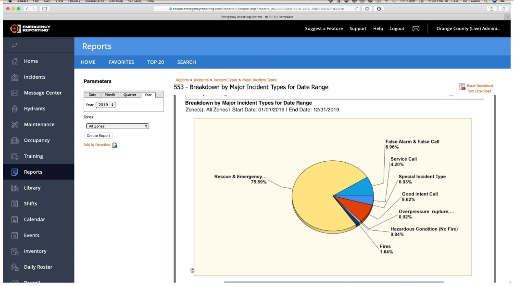
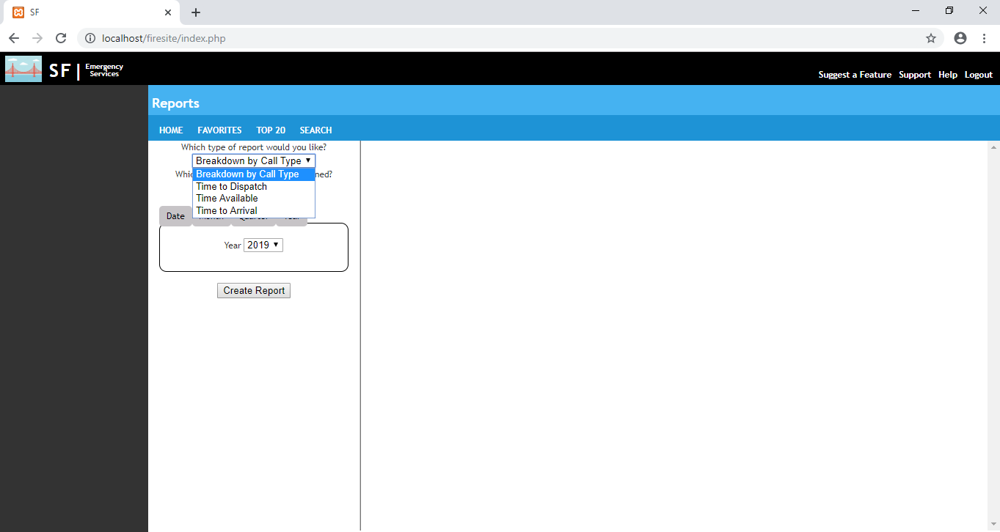
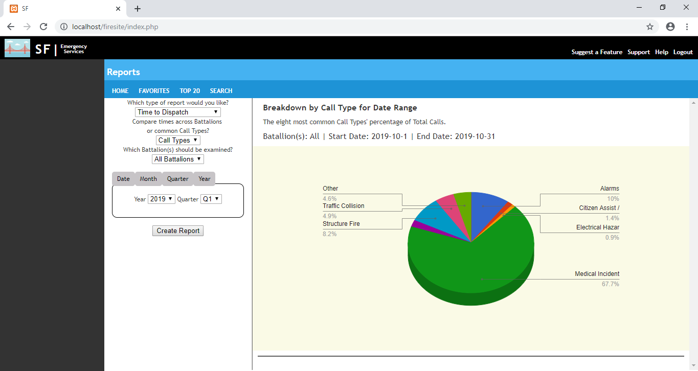
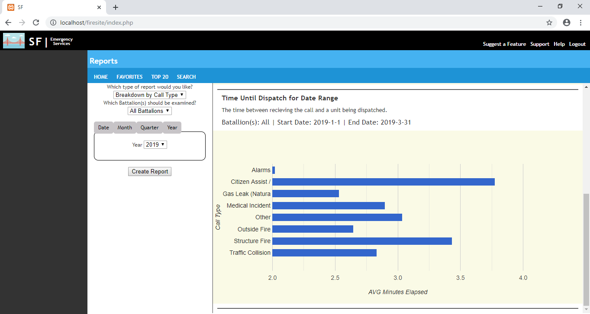
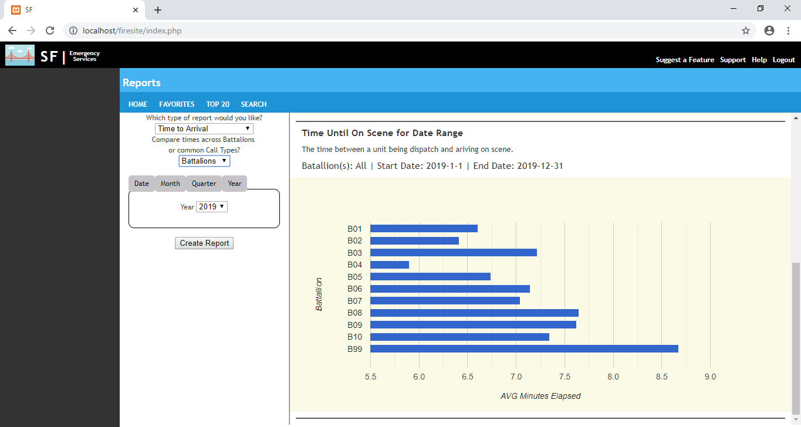

# Emergency Service Web App
I was considering applying for a software engineer job at a company called Emergency Reporting. Their a SaaS company catering to emergency services around the U.S.. From the job description I knew that I'd need skills in PHP, Javascript and SQL. I'm comfortable with SQL, but I had never used PHP or Javascript. So I decided to create using those languages in order to learn them and to get a better idea of how I'd enjoy similar projects.

I looked throught the company's website and found this screenshot showing how their site creates reports/charts for the user. I thought this looked like an especially interesting project. I knew that Kaggle had at least a couple datasets related to crimes or other emergencies that were submitted by municipalities. So I'd be working with similar data as well.

So after dusting off any html skills I had I started creating my own web app. I was going with a similar look as the original, but I decided I wasn't going to torture myself over the details. Especially because what I was actually focusing on was a small part of the whole, and I did not see much value in completely replicating the site with links to pages I would never create.

After I had the basic design of my app done (Essentially looked like the screenshot above) I started add the dynamic aspects. I skimmed through a short course on codecademy and a couple other resources on PHP and Javascript and after that just did a whole lot of googling and stack exchange. 

The end result of the project was fairly open ended. I wanted a web app that could create a Pie Chart by taking user inputs and then querying a database, and I'd like to create a couple other charts to using available data. The vagueness of the second part resulted in a significant amount of time going back and forth on what options to add. Should the user have an option to filter the data to only include Medical units is one example. There were a lot of potential options though, so I wish I had a better plan going in.

I realize there is likely a more sophisticated environment around the report system. But since I was just going to have four different aspect of the database for the use to explore I just gave them a dropdown to pick their Report Type (shown below). 

The user can also select if they want to see info about All Battalions or a specific one (this option is not available when comparing between Battalions for the three time based reports since all battalions can fit in the bar chart). They can also select the date range as a year, quarter, month, or date.

After hitting create report the chart and relevant info is generated in the right section of the display and the user inputs are reset.

The above screenshot shows the parameters used for the bar chart shown below.

While the chart shown above compares time between Call Types, the user can also select to compare between battalions, as shown below.

### Things I may change with more time
Because this was a project that was being built while I was learning there were a lot of choices that were made before I realized something important, and those choices either had to be changed or I went along with it and found a workaround. If I were to start from scratch or if I get the urge to clean this project up these are the first things I'll fix
* Better CSS and HTML, I relied heavily on individual element ids instead of using classes and more foresight. I also imitated the original screenshot's aesthetics without trying to hard to nail them down. So they just look a bit clunky, I'd have gotten a better look by being more thorough or just creating my own theme from the start.
* Implement JS frameworks like Ajax or Bootstrap, which I originally saw as things that would take too much time to learn, but in reality probably would have saved time.
* Store different report types in an array since each is several words like "Breakdown by Call Type". 
* I would not use Google Charts, this seemed like the easiest API to impliment but I did run into a couple small issues and because Charts doesn't have much documentation this took more time than I'd like to resolve. Also these charts are so rigid its infuriating. For example I could not get all the slices of my Pie Charts to be labeled because the labels won't go above/below the chart even if there's room.
